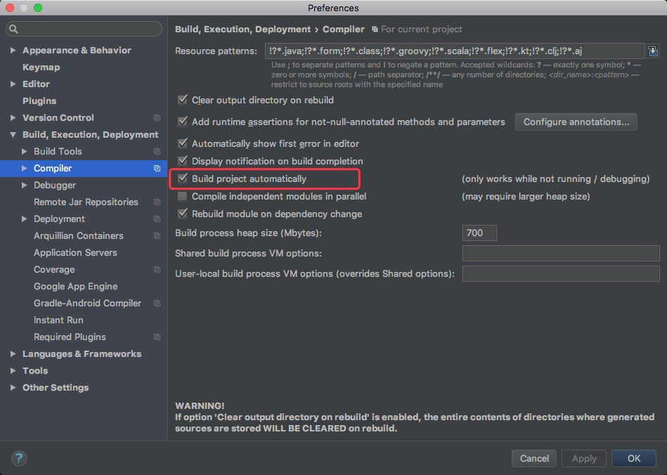
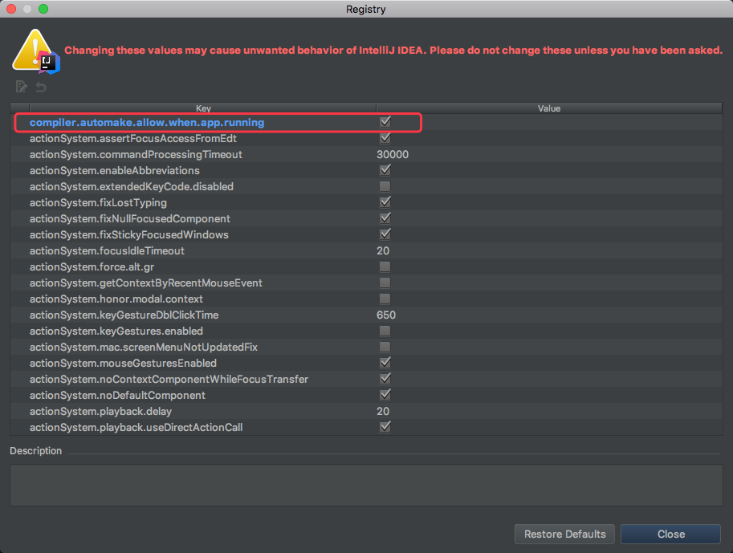
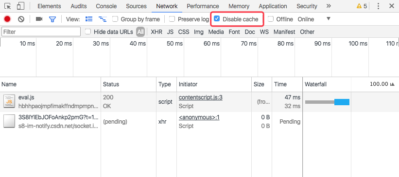

# spring-boot-devtool

## 1. pom.xml

添加依赖

```
<dependency>
	<groupId>org.springframework.boot</groupId>
	<artifactId>spring-boot-devtools</artifactId>
	<!-- optional=true,依赖不会传递 -->
	<optional>true</optional>
	<scope>runtime</scope>
</dependency>
```

如果是Eclipse 中使用，则需要添加插件， Idea中不需要：

```
<build>
    <plugins>
        <plugin>
            <groupId>org.springframework.boot</groupId>
            <artifactId>spring-boot-maven-plugin</artifactId>
            <configuration>
                <fork>true</fork>
            </configuration>
        </plugin>
    </plugins>
</build>
```

## 2. 更改Idea配置

1.  “File” -> “Settings” -> “Build,Execution,Deplyment” -> “Compiler”，选中打勾 “Build project automatically”。



2.  组合键：（Windows平台）“Shift+Ctrl+Alt+/” 、(MAC平台)“Shift+CMD+Alt+/” ，选择 “Registry” ，选中打勾 “compiler.automake.allow.when.app.running” 。



## 3. Chrome禁用缓存

　　F12或者“Ctrl+Shift+I”，打开开发者工具，“Network” 选项卡下 选中打勾 “Disable Cache(while DevTools is open)” 
　　
