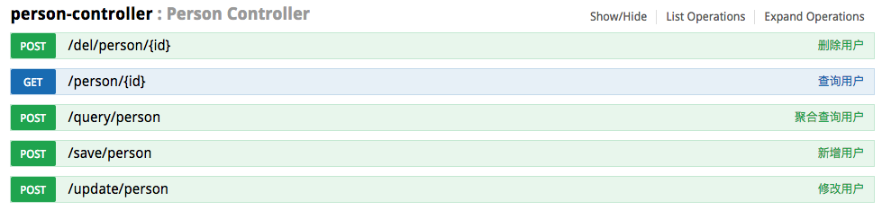

# spring-boot-elasticsearch5

Spring Boot 整合 Elasticsearch5.x 的Demo。

由于Spring boot 目前SpringBoot 1.5.1.RELEASE 和 Spring Data Elasticsearch 2.10.RELEASE仅支持ElasticSearch 2.4.0。 

但不支持最新版本的 ElasticSearch 5.x版本。

注意Elasticsearch版本问题。这里使用的是最5.x的最新版5.6.4。

CentOS7 下载命令：

```
$ wget https://artifacts.elastic.co/downloads/elasticsearch/elasticsearch-5.6.4.tar.gz
```

演示的 Elasticsearch 5.6.4 服务器已经装好了，地址：192.168.191.32


## 配置

application.properties

```java
server.port=8888

elasticsearch.cluster.name=my-application
elasticsearch.host=192.168.235.32:9300
```

Elasticsearch配置类，

ElasticsearchConfig.java

```
@Configuration
public class ElasticsearchConfig {

    @Value("${elasticsearch.cluster.name}")
    private String clusterName;

    @Value("${elasticsearch.host}")
    private String host;

    @Bean
    public TransportClient transportClient() throws UnknownHostException {
        // 设置集群名称
        Settings settings = Settings.builder().put("cluster.name", clusterName)
                .build();
        TransportClient transportClient = new PreBuiltTransportClient(settings);
        String[] nodes = host.split(",");
        for (String node : nodes) {
            if (node.length() > 0) {
                String[] hostPort = node.split(":");
                transportClient.addTransportAddress(
                        new InetSocketTransportAddress(
                                InetAddress.getByName(hostPort[0]),
                                Integer.parseInt(hostPort[1])
                        )
                );
            }
        }
        return transportClient;
    }

}
```

## 运行

在服务器上启动Elasticsearch 5.6.4 服务,

注意不能使用root 用户启动，

进入Elasticsearch 5.6.4文件夹，

输入启动命令：

```
./bin/elasticsearch -d
```

查看所有接口：

http://localhost:8888/swagger-ui.html



