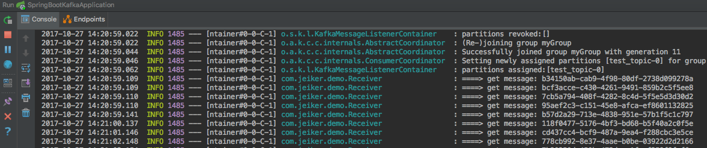

# spring-boot-kafka

Spring Boot 配合 kafka。

## 安装

假定已经安装好 Kafka 。

* 服务器名为：192.168.235.32
* 端口为：9092

## 项目配置


application.properties文件中配置 kafka:

```java

spring.kafka.bootstrap-servers=192.168.235.32:9092
spring.kafka.consumer.group-id=myGroup
spring.kafka.consumer.key-deserializer=org.apache.kafka.common.serialization.StringDeserializer
spring.kafka.consumer.value-deserializer=org.apache.kafka.common.serialization.StringDeserializer
spring.kafka.producer.key-serializer=org.apache.kafka.common.serialization.StringSerializer
spring.kafka.producer.value-serializer=org.apache.kafka.common.serialization.StringSerializer
```

## 工程

### 消息体

Message.java

```java

public class Message {

    private Long id;
    private String msg;
    private Date sendTime;

    public Long getId() {
        return id;
    }
    public void setId(Long id) {
        this.id = id;
    }
    public String getMsg() {
        return msg;
    }
    public void setMsg(String msg) {
        this.msg = msg;
    }
    public Date getSendTime() {
        return sendTime;
    }
    public void setSendTime(Date sendTime) {
        this.sendTime = sendTime;
    }

    @Override
    public String toString() {
        return "Message{" +
                "id=" + id +
                ", msg='" + msg + '\'' +
                ", sendTime=" + sendTime +
                '}';
    }
}
```

### 生产者

Sender.java

发送消息。

```java

@Component
public class Sender {

    @Autowired
    private KafkaTemplate kafkaTemplate;

    private Gson gson = new GsonBuilder().create();

    public void sendMessage(){
        Message message = new Message();
        message.setId(System.currentTimeMillis());
        message.setMsg(UUID.randomUUID().toString());
        message.setSendTime(new Date());
        kafkaTemplate.send("test_topic", gson.toJson(message));
    }
}
```

### 消费者

Receiver.java

监听主题消息，将接收到的消息体转为model，然后输出日志。

```java

@Component
public class Receiver {

    private static final Logger logger = LoggerFactory.getLogger(Receiver.class);

    private Gson gson = new GsonBuilder().create();

    @KafkaListener(topics = "test_topic")
    public void processMessage(String content) {
        Message message = gson.fromJson(content, Message.class);
        logger.info("====> get message: {}", message.getMsg());
    }
}
```


启动类：

```java

@SpringBootApplication
public class SpringBootKafkaApplication {

	public static void main(String[] args) throws InterruptedException {

		ApplicationContext app = SpringApplication.run(SpringBootKafkaApplication.class, args);

		while(true){
			Sender sender = app.getBean(Sender.class);
			sender.sendMessage();
			Thread.sleep(1000);
		}
	}
}

```

查看运行结果：



