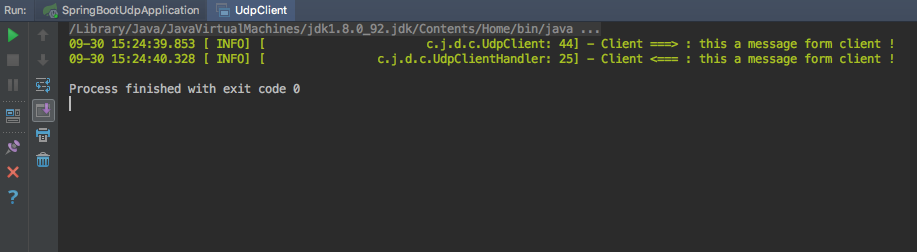
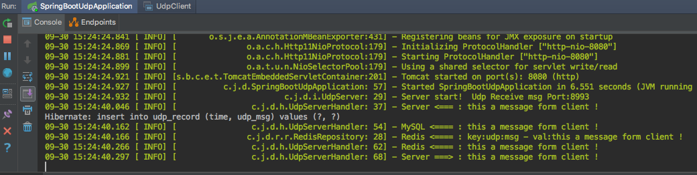

# spring-boot-udp

使用Spring Boot 使用 UDP 进行通信的 Demo.

使用技术：

* Spring Boot
* Netty4
* Log4j2
* Redis
* MySQL

## pom.xml

```xml
<dependency>
	<groupId>org.springframework.boot</groupId>
	<artifactId>spring-boot-starter</artifactId>
	<exclusions>
		<exclusion>
			<groupId>org.springframework.boot</groupId>
			<artifactId>spring-boot-starter-logging</artifactId>
		</exclusion>
	</exclusions>
</dependency>
<dependency>
	<groupId>org.springframework.boot</groupId>
	<artifactId>spring-boot-starter-log4j2</artifactId>
</dependency>
<dependency>
	<groupId>org.springframework.boot</groupId>
	<artifactId>spring-boot-starter-data-jpa</artifactId>
</dependency>
<dependency>
	<groupId>org.springframework.boot</groupId>
	<artifactId>spring-boot-starter-data-redis</artifactId>
</dependency>
<dependency>
	<groupId>org.springframework.boot</groupId>
	<artifactId>spring-boot-starter-web</artifactId>
</dependency>

<dependency>
	<groupId>mysql</groupId>
	<artifactId>mysql-connector-java</artifactId>
	<scope>runtime</scope>
</dependency>
<dependency>
	<groupId>org.springframework.boot</groupId>
	<artifactId>spring-boot-starter-test</artifactId>
	<scope>test</scope>
</dependency>

<dependency>
	<groupId>io.netty</groupId>
	<artifactId>netty-all</artifactId>
	<version>4.1.16.Final</version>
</dependency>
<dependency>
	<groupId>org.apache.commons</groupId>
	<artifactId>commons-lang3</artifactId>
	<version>3.6</version>
</dependency>
```

## application.properties

```properties
spring.messages.encoding=utf-8
logging.config=classpath:log4j2.properties

# 监听器，程序入口
context.listener.classes=com.jeiker.demo.init.StartupEvent

# mysql 配置
spring.jpa.show-sql=true
spring.jpa.database=mysql
#spring.jpa.hibernate.ddl-auto=update
spring.datasource.url=jdbc:mysql://127.0.0.1/mydb?characterEncoding=utf8&useSSL=true
spring.datasource.username=root
spring.datasource.password=123456
spring.datasource.driver-class-name=com.mysql.jdbc.Driver
spring.datasource.jdbc-interceptors=ConnectionState;SlowQueryReport(threshold=0)

spring.session.store-type=none

# (RedisProperties)
spring.redis.database=3
spring.redis.host=127.0.0.1
spring.redis.port=6379
#spring.redis.password=123456
spring.redis.pool.max-active=8
spring.redis.pool.max-wait=-1
spring.redis.pool.max-idle=8
spring.redis.pool.min-idle=0
spring.redis.timeout=0

# UDP 服务器端口
sysfig.udpReceivePort = 8993

# 系统配置
sysfig.corePoolSize = 5
sysfig.maxPoolSize = 100
sysfig.keepAliveSeconds = 100
sysfig.queueCapacity = 1000
```

## 启动

1. 先运行 Spring Boot 项目。
2. 再运行测试用的Client main（）方法。

说明：

1. Spring Boot项目中启动了 UDP Server 端。
2. Client 向 UDP Server 发送测试消息。
3. Server 收到 Client 发来的消息，保存到 MySQL 和 Redis 中，并原消息返回 Client 端。





