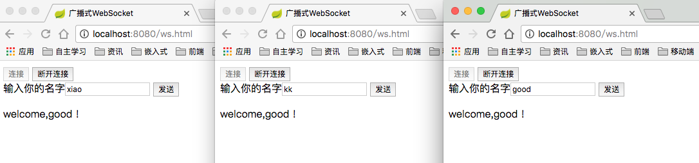

# spring-boot-websocket

Spring Boot 使用 Websocket。


## 项目代码


WebSocketConfig.java

```java

@Configuration
@EnableWebSocketMessageBroker // 开启使用STOMP协议来传输基于代理的消息
public class WebSocketConfig extends AbstractWebSocketMessageBrokerConfigurer{

    @Override
    public void registerStompEndpoints(StompEndpointRegistry stompEndpointRegistry) {
        // 注册STOMP协议的节点，并指定映射的URL
        // 注册STOMP协议节点，同时指定使用SockJS协议
        stompEndpointRegistry.addEndpoint("/endpointSang").withSockJS();
    }

    @Override
    public void configureMessageBroker(MessageBrokerRegistry registry) {
        // 配置消息代理, 实现推送功能，这里的消息代理是/topic
        registry.enableSimpleBroker("/topic");
    }
}

```

两个消息对象

RequestMessage.java

```java

public class RequestMessage {

    private String name;

    public String getName() {
        return name;
    }
}

```

ResponseMessage.java

```java

public class ResponseMessage {

    private String responseMessage;

    public ResponseMessage(String responseMessage) {
        this.responseMessage = responseMessage;
    }

    public String getResponseMessage() {
        return responseMessage;
    }
}


```


WsController.java


```java

@Controller
public class WsController {

    private static final Logger logger = LoggerFactory.getLogger(WsController.class);

    @MessageMapping("/welcome")
    @SendTo("/topic/getResponse")
    public ResponseMessage say(RequestMessage message) {
        logger.info(message.getName());
        return new ResponseMessage("welcome," + message.getName() + " !");
    }
}


```

## 前端测试页面

ws.html

```html

<!DOCTYPE html>
<html lang="en">
<head>
    <meta charset="UTF-8"/>
    <title>广播式WebSocket</title>
    <script src="js/sockjs.min.js"></script>
    <script src="js/stomp.js"></script>
    <script src="js/jquery-3.1.1.js"></script>
</head>
<body onload="disconnect()">
<noscript><h2 style="color: #e80b0a;">Sorry，浏览器不支持WebSocket</h2></noscript>
<div>
    <div>
        <button id="connect" onclick="connect();">连接</button>
        <button id="disconnect" disabled="disabled" onclick="disconnect();">断开连接</button>
    </div>

    <div id="conversationDiv">
        <label>输入你的名字</label><input type="text" id="name"/>
        <button id="sendName" onclick="sendName();">发送</button>
        <p id="response"></p>
    </div>
</div>
<script type="text/javascript">
    var stompClient = null;

    function setConnected(connected) {
        document.getElementById("connect").disabled = connected;
        document.getElementById("disconnect").disabled = !connected;
        document.getElementById("conversationDiv").style.visibility = connected ? 'visible' : 'hidden';
//        $("#connect").disabled = connected;
//        $("#disconnect").disabled = !connected;
        $("#response").html();
    }

    function connect() {
        var socket = new SockJS('/endpointSang');
        stompClient = Stomp.over(socket);
        stompClient.connect({}, function (frame) {
            setConnected(true);
            console.log('Connected:' + frame);
            stompClient.subscribe('/topic/getResponse', function (response) {
                showResponse(JSON.parse(response.body).responseMessage);
            })
        });
    }

    function disconnect() {
        if (stompClient != null) {
            stompClient.disconnect();
        }
        setConnected(false);
        console.log('Disconnected');
    }

    function sendName() {
        var name = $('#name').val();
        console.log('name:' + name);
        stompClient.send("/welcome", {}, JSON.stringify({'name': name}));
    }

    function showResponse(message) {
        $("#response").html(message);
    }
</script>
</body>
</html>
```


## 运行


- http://localhost:8080/ws.html




